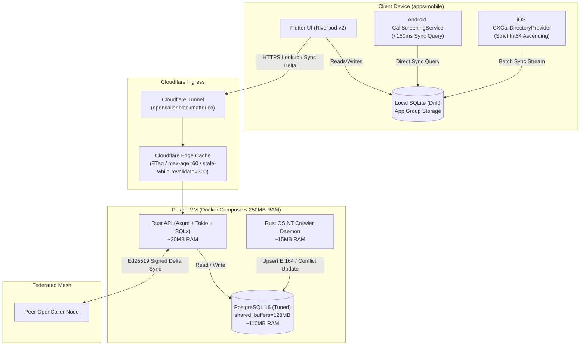

# Implementation Plan: OpenCaller Monorepo Architecture & Telephony System

OpenCaller is an ultra-lightweight, 100% open-source, community-driven, and federated alternative to Truecaller. It is designed to be self-hosted on a Rocky Linux VM ("Polaris") behind a Cloudflare Tunnel (`opencaller.blackmatter.cc`) with a strict memory footprint constraint (<250 MB total RAM for the entire backend stack), alongside full native telephony integration on iOS and Android.

---

## User Review Required

> [!IMPORTANT]
> **Key Architecture Decisions for Approval:**
> 1. **Backend Database: PostgreSQL 16 (Tuned) vs SQLite**:
>    As analyzed, PostgreSQL 16 will be used on the server with memory-constrained configuration (`shared_buffers = 128MB`, `work_mem = 4MB`, `max_connections = 60`), guaranteeing concurrent write throughput for community reporting, OSINT crawlers, and federated node synchronizations without SQLite write locks. SQLite (`drift`) will be used on the client device for instant local lookups (<5ms).
> 2. **Apple Call Directory Extension Requirements**:
>    Phase 1 implements offline-first Call Directory Extension (`CXCallDirectoryProvider`) and App Intents. Phone numbers are exported from the shared App Group SQLite database to iOS in **strictly ascending `Int64` numerical order**. This works with any standard $99/year Apple Developer account without special entitlement approvals. Phase 2 will prepare endpoints for iOS 18 Private Information Retrieval (PIR) validation.
> 3. **Android Call Screening Role**:
>    Android requires granting the `ROLE_CALL_SCREENING` role to intercept calls before the phone rings. A Setup Wizard in the Flutter app will prompt the user via `RoleManager`.
> 4. **Futuristic UI Platform Strategy**:
>    To satisfy the requirement of modern futuristic aesthetics while **avoiding blur on Android** (where `BackdropFilter` causes GPU fill-rate bottlenecks and frame drops), we adopt the design system from `portal-master`:
>    - **iOS / macOS / Web**: Full glassmorphism with `ImageFilter.blur` and specular gradient borders.
>    - **Android**: Solid dark translucent surfaces (`0x1AFFFFFF` / `#1A1A1A`), glowing borders, neon drop shadows, and subtle linear gradients without GPU blur filters.

---

## System Architecture



---

## Reusable Assets from `portal-master`

From inspecting `/home/sgarita/Documents/GitHub/portal-master`, we extract and adapt the following battle-tested components:

1. **Design Tokens & Palette**:
   - `GlassColors`: Deep black (`#0F0F0F`), dark gray (`#1A1A1A`), neon purple (`#9333EA`), cyber blue (`#2563EB`), emerald green (`#10B981`) for verified callers, and crimson red (`#EF4444`) for high-risk scammers.
   - `AppTypography`: Clean high-tech monospace and modern sans-serif styles (`SpaceGrotesk` / system typography fallback).
2. **Platform-Adaptive Glass Surfaces**:
   - `AdaptiveGlassSurface`: Evaluates `Theme.of(context).platform`. On Android, applies high-performance translucent container styling without `BackdropFilter`; on iOS/Desktop, applies frosted glass blur.
3. **Interactive Futuristic Controls**:
   - `NeonGlowButton`: Multi-layered neon glow button with press animations and loading spinners.
   - `GlassCard` / `GlassContainer`: Border gradients with inner glow for caller ID cards and spam statistics.

---

## Monorepo Directory Structure

```text
opencaller/
├── docker-compose.yml
├── .env.example
├── README.md
├── SELF_HOSTING.md
├── services/
│   ├── api/                          # Rust Axum Core API
│   │   ├── Cargo.toml
│   │   ├── Dockerfile
│   │   └── src/
│   │       ├── main.rs
│   │       ├── config.rs
│   │       ├── error.rs
│   │       ├── db/
│   │       │   └── mod.rs
│   │       ├── models/
│   │       │   ├── user.rs
│   │       │   ├── number.rs
│   │       │   ├── report.rs
│   │       │   └── federation.rs
│   │       ├── routes/
│   │       │   ├── mod.rs
│   │       │   ├── auth.rs
│   │       │   ├── lookup.rs
│   │       │   ├── sync.rs
│   │       │   ├── report.rs
│   │       │   └── federation.rs
│   │       ├── middleware/
│   │       │   ├── auth.rs
│   │       │   └── etag.rs
│   │       └── scoring/
│   │           └── bayesian.rs
│   ├── crawler/                      # Rust OSINT & Ingestion Daemon
│   │   ├── Cargo.toml
│   │   ├── Dockerfile
│   │   └── src/
│   │       ├── main.rs
│   │       ├── normalizer.rs         # E.164 phone number parser
│   │       └── adapters/
│   │           ├── mod.rs
│   │           ├── open_registries.rs
│   │           └── git_spam_lists.rs
│   └── migrations/                   # SQLx PostgreSQL Migrations
│       └── 20260901000000_initial_schema.sql
└── apps/
    └── mobile/                       # Flutter Mobile Client
        ├── pubspec.yaml
        ├── lib/
        │   ├── main.dart
        │   ├── core/
        │   │   ├── theme/
        │   │   │   ├── glass_colors.dart
        │   │   │   ├── app_typography.dart
        │   │   │   ├── platform_glass_surface.dart
        │   │   │   └── neon_glow_button.dart
        │   │   ├── database/
        │   │   │   ├── app_database.dart       # Drift SQLite (App Group path on iOS)
        │   │   │   └── app_database.g.dart
        │   │   ├── network/
        │   │   │   ├── api_client.dart         # Dio with ETag cache interceptor
        │   │   │   └── sync_service.dart
        │   │   └── telephony/
        │   │       ├── telephony_platform.dart # MethodChannels
        │   │       ├── android_screening.dart
        │   │       └── ios_call_directory.dart
        │   └── features/
        │       ├── lookup/                     # Number Lookup & Live Search
        │       ├── dialer/                     # Keypad & Call History
        │       ├── reports/                    # Community Spam Reporting
        │       └── onboarding/                 # Telephony Setup Wizard
        ├── android/
        │   └── app/src/main/kotlin/cc/blackmatter/opencaller/
        │       ├── MainActivity.kt
        │       ├── OpenCallerScreeningService.kt
        │       └── CallScreeningPlugin.kt
        └── ios/
            ├── Runner/
            │   ├── AppDelegate.swift
            │   └── CallKitPlugin.swift
            └── OpenCallerCallDirectoryExtension/
                ├── CallDirectoryHandler.swift
                └── Info.plist
```

---

## Proposed Changes

### Phase 1: Docker Architecture, Tuned PostgreSQL & Database Migrations

#### [NEW] `docker-compose.yml`
Configures a minimal, production-ready stack for Rocky Linux ("Polaris"):
- `postgres`: PostgreSQL 16 Alpine tuned for low memory (`shared_buffers = 128MB`, `work_mem = 4MB`, `max_connections = 60`, `checkpoint_completion_target = 0.9`). Total memory ceiling < 120MB.
- `opencaller-api`: Rust Axum release container built via multi-stage Dockerfile (`debian:bookworm-slim` or `alpine`), memory limit 50MB.
- `opencaller-crawler`: Background daemon for OSINT feeds, memory limit 40MB.
- `cloudflared`: Official Cloudflare Tunnel client connecting `opencaller.blackmatter.cc` directly to the `opencaller-api` port 8080.

#### [NEW] `services/migrations/20260901000000_initial_schema.sql`
PostgreSQL DDL:
- `users`: ID, username, password_hash, reputation_score, is_node_admin, created_at.
- `numbers`: e164_number (`BIGINT PRIMARY KEY`), country_code, caller_name, spam_score (`REAL`), report_count, category, source_flags, last_reported_at, updated_at.
- `reports`: id, e164_number, reporter_id, category, comment, created_at.
- `federation_nodes`: id, node_url, public_key, trust_weight, last_synced_at.
- Indexes: `idx_numbers_country_score` on `(country_code, spam_score)` and `idx_numbers_updated_at` on `(updated_at)`.

---

### Phase 2: High-Performance Rust API (`services/api`)

#### [NEW] `services/api/Cargo.toml`
Dependencies:
- `axum = "0.8"` (or latest stable)
- `tokio = { version = "1.40", features = ["full"] }`
- `sqlx = { version = "0.8", features = ["runtime-tokio-rustls", "postgres", "chrono", "uuid"] }`
- `tower-http = { version = "0.6", features = ["cors", "trace", "compression-zstd", "compression-gzip"] }`
- `argon2 = "0.5"` (for high-security password hashing)
- `jsonwebtoken = "9.3"` (Ed25519 / HMAC-SHA256 stateless tokens)
- `ed25519-dalek = "2.1"` (for federation delta signing and verification)
- `serde`, `serde_json`, `tracing`, `tracing-subscriber`

#### [NEW] `services/api/src/routes/sync.rs` & Delta Synchronization Protocol
- Endpoint: `GET /v1/sync/delta?country=:code&since=:timestamp&limit=:limit`
- **iOS Sorting Guarantee**: Executes:
  ```sql
  SELECT e164_number, caller_name, spam_score, category 
  FROM numbers 
  WHERE country_code = $1 AND updated_at > $2
  ORDER BY e164_number ASC 
  LIMIT $3;
  ```
- **ETag & Edge Caching**:
  Generates an MD5/SHA256 hash of the output payload. If `If-None-Match` matches, responds immediately with `304 Not Modified`. Sets `Cache-Control: public, max-age=60, stale-while-revalidate=300`.

#### [NEW] `services/api/src/scoring/bayesian.rs`
- Bayesian scoring algorithm taking into account user `reputation_score`, `report_count`, and report recency to calculate a normalized `spam_score` between `0.00` (clean) and `1.00` (verified scammer).

#### [NEW] `services/api/src/routes/federation.rs`
- Node-to-node delta sync: Nodes exchange updates signed with their Ed25519 keys, validating trust weight before upserting into the local PostgreSQL cluster.

---

### Phase 3: Automated OSINT & Ingestion Crawler (`services/crawler`)

#### [NEW] `services/crawler/src/normalizer.rs`
- Cleans and converts any incoming phone representation (e.g., `+506 8888-8888`, `(506) 88888888`, `0050688888888`) into pure numeric E.164 `Int64` format (e.g. `50688888888`).
- Extracts valid ISO country code prefixes.

#### [NEW] `services/crawler/src/adapters/`
- `open_registries.rs`: Scrapes open CSV and JSON public datasets (e.g. FTC robocall complaints, open carrier spam blocks).
- `git_spam_lists.rs`: Ingests open-source spam lists maintained on GitHub, de-duplicating and streaming updates into PostgreSQL via `ON CONFLICT (e164_number) DO UPDATE SET report_count = numbers.report_count + 1, updated_at = NOW()`.

---

### Phase 4: Mobile Client (`apps/mobile`) & Futuristic UI

#### [NEW] `apps/mobile/lib/core/theme/platform_glass_surface.dart` & `glass_colors.dart`
- Adapted from `portal-master` with explicit Android optimization:
  ```dart
  import 'dart:io' show Platform;
  import 'dart:ui';
  import 'package:flutter/foundation.dart';
  import 'package:flutter/material.dart';

  class PlatformGlassSurface extends StatelessWidget {
    final Widget child;
    final BorderRadius borderRadius;
    final Color borderColor;
    final double borderWidth;
    final double blurSigma;
    final Color? fillColor;

    const PlatformGlassSurface({
      super.key,
      required this.child,
      required this.borderRadius,
      this.borderColor = const Color(0x33FFFFFF),
      this.borderWidth = 1.0,
      this.blurSigma = 20.0,
      this.fillColor,
    });

    @override
    Widget build(BuildContext context) {
      final isAndroid = !kIsWeb && Platform.isAndroid;
      final effectiveFill = fillColor ?? const Color(0xFF161616).withValues(alpha: 0.85);

      final decoration = BoxDecoration(
        color: effectiveFill,
        borderRadius: borderRadius,
        border: Border.all(color: borderColor, width: borderWidth),
        boxShadow: [
          BoxShadow(
            color: Colors.black.withValues(alpha: 0.25),
            blurRadius: 16,
            offset: const Offset(0, 4),
          ),
        ],
      );

      // On Android: Avoid BackdropFilter to eliminate GPU fillrate bottlenecks
      if (isAndroid) {
        return Container(
          decoration: decoration,
          child: child,
        );
      }

      // On iOS/Desktop/Web: Full glassmorphism blur
      return ClipRRect(
        borderRadius: borderRadius,
        child: BackdropFilter(
          filter: ImageFilter.blur(sigmaX: blurSigma, sigmaY: blurSigma),
          child: Container(
            decoration: decoration,
            child: child,
          ),
        ),
      );
    }
  }
  ```

#### [NEW] `apps/mobile/lib/core/database/app_database.dart`
- Drift SQLite setup configured with `NativeDatabase.createInBackground`.
- On iOS: Path resolves to the shared App Group container directory:
  `FileManager.default.containerURL(forSecurityApplicationGroupIdentifier: "group.cc.blackmatter.opencaller")`.
- On Android: Path resolves to standard `getApplicationDocumentsDirectory()`.

#### [NEW] UI Screens (`apps/mobile/lib/features/`)
- `lookup/`: Live search dialer with instant caller ID results, category badges (Spam, Scam, Delivery, Verified), and community trust meters.
- `dialer/` & `reports/`: Incoming call log and single-tap community reporting modal with category tags and comments.
- `onboarding/`: Modern setup wizard guiding the user through granting CallScreening permissions on Android and enabling the Call Directory Extension in iOS Settings.

---

### Phase 5: Native Telephony Implementations

#### [NEW] Android Subsystem (`android/app/src/main/kotlin/cc/blackmatter/opencaller/`)
1. `OpenCallerScreeningService.kt`:
   Extends `CallScreeningService`.
   - Extracts number from `details.handle.schemeSpecificPart`.
   - Opens the local Drift SQLite database directly via Android SQLite API or shared helper.
   - Synchronously queries the `numbers` table with a strict timeout (<150ms).
   - If `spam_score >= 0.80`:
     ```kotlin
     val response = CallResponse.Builder()
         .setDisallowCall(true)
         .setRejectCall(true)
         .setSkipCallLog(false)
         .setSkipNotification(false)
         .build()
     respondToCall(details, response)
     ```
2. `CallScreeningPlugin.kt`:
   Registers MethodChannel `cc.blackmatter.opencaller/call_screening`.
   - Handles `requestRole`: launches `roleManager.createRequestRoleIntent(RoleManager.ROLE_CALL_SCREENING)`.
   - Handles `checkRoleStatus`: queries `roleManager.isRoleHeld(RoleManager.ROLE_CALL_SCREENING)`.

#### [NEW] iOS Subsystem (`ios/OpenCallerCallDirectoryExtension/`)
1. `CallDirectoryHandler.swift`:
   Implements `CXCallDirectoryProvider`.
   - Connects to the shared App Group SQLite file located at `group.cc.blackmatter.opencaller`.
   - Queries numbers: `SELECT e164_number, caller_name, spam_score FROM numbers ORDER BY e164_number ASC`.
   - Iterates through the sorted stream:
     ```swift
     for item in sortedEntries {
         if item.spamScore >= 0.80 {
             context.addBlockingEntry(withNextSequentialPhoneNumber: item.e164Number)
         } else if let name = item.callerName {
             context.addIdentificationEntry(withNextSequentialPhoneNumber: item.e164Number, label: name)
         }
     }
     ```
   - **Enforces strict sequential order validation** before passing to iOS to avoid silent CallKit extension failure.
2. `CallKitPlugin.swift`:
   Registers MethodChannel `cc.blackmatter.opencaller/callkit`.
   - Checks `CXCallDirectoryManager.sharedInstance.getEnabledStatusForExtension`.
   - Invokes `CXCallDirectoryManager.sharedInstance.reloadExtension(withIdentifier: "cc.blackmatter.opencaller.OpenCallerCallDirectoryExtension")`.
3. App Intent / Siri Shortcut:
   Provides "Search in OpenCaller" for on-demand query fallback.

---

### Phase 6: Documentation & Polaris VM Deployment

#### [NEW] `SELF_HOSTING.md`
- Step-by-step instructions for Rocky Linux / RHEL / AlmaLinux hosts:
  1. Installing Docker & Docker Compose.
  2. Setting up Cloudflare Tunnel (`cloudflared tunnel create opencaller-seed`).
  3. Configuring DNS record for `opencaller.blackmatter.cc`.
  4. Launching the stack: `docker compose up -d`.
  5. Monitoring RAM usage: `docker stats` (verifying <250 MB ceiling).
- iOS Signing & Provisioning Guide:
  1. Creating App ID with App Group capability (`group.cc.blackmatter.opencaller`).
  2. Creating Call Directory Extension target and matching provisioning profile.

---

## Verification Plan

### Automated Tests
1. **Rust Backend API & Database**:
   ```bash
   cd services/api
   cargo test -- --nocapture
   ```
   - Tests registration, login, and JWT validation.
   - Tests `/v1/sync/delta` guarantees strictly ascending numerical order (`Int64`).
   - Tests ETag calculation and `If-None-Match` 304 response.
   - Tests Bayesian scoring calculation.
2. **OSINT Crawler**:
   ```bash
   cd services/crawler
   cargo test
   ```
   - Tests E.164 phone number normalization across international formats.
3. **Flutter App Analysis & Tests**:
   ```bash
   cd apps/mobile
   flutter analyze
   flutter test
   ```
   - Verifies widget rendering, platform glass behavior on Android vs iOS, and Drift database CRUD operations.

### Manual Verification
1. **Server Footprint on Rocky Linux**:
   - Run `docker compose up -d`
   - Run `docker stats --no-stream` and verify the combined memory usage of Postgres, API, and Crawler is under 250 MB.
2. **iOS CallKit Verification**:
   - Deploy to iOS device or simulator.
   - Run `reloadExtension` and inspect `CXCallDirectoryManager` status.
   - Verify incoming call display shows custom caller ID for known numbers in the test dataset.
3. **Android Call Screening Verification**:
   - Grant `ROLE_CALL_SCREENING` via the onboarding wizard.
   - Simulate an incoming call from a test spam number (`spam_score >= 0.80`) and confirm rejection without ringing.
