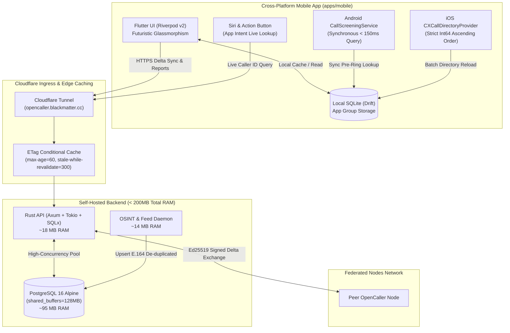
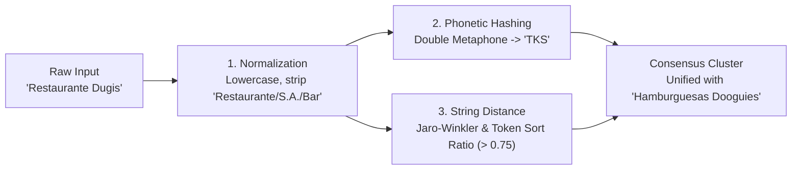
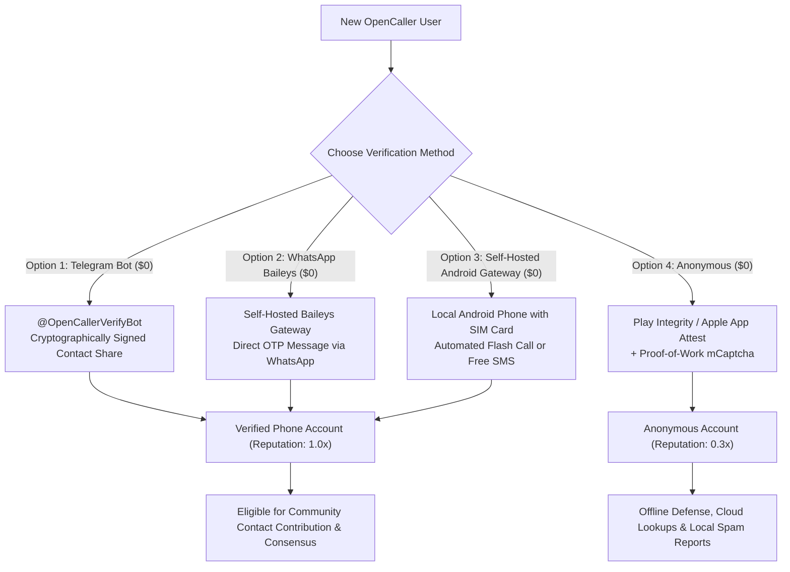

<p align="center">
  
</p>

<h1 align="center">🛡️ OpenCaller</h1>

<p align="center">
  <strong>Ultra-lightweight, 100% open-source, community-driven, and federated alternative to Truecaller.</strong><br>
  Built with extreme privacy sovereignty, Rust Axum backend (<25MB RAM), and native CallKit & CallScreening telephony bridges.
</p>

<p align="center">
  <a href="#-architecture"></a>
  <a href="#-backend"></a>
  <a href="#-database"></a>
  <a href="#-mobile"></a>
  <a href="#-license"></a>
</p>

---

## ⚡ Why OpenCaller?

Proprietary caller ID applications like Truecaller monetize user surveillance, commercialize contact books, inject intrusive ads, and lock premium spam protection behind recurring paywalls. 

**OpenCaller** reclaims incoming call defense for the open web:

| Feature | Truecaller | OpenCaller |
| :--- | :---: | :---: |
| **Open Source** | ❌ Proprietary | ✅ **100% Open Source** (MIT) |
| **Self-Hostable** | ❌ Closed Cloud | ✅ **Docker Compose (< 200MB RAM)** |
| **Privacy Sovereignty** | ❌ Contact Harvesting & Data Brokerage | ✅ **Zero Data Selling / Privacy Controls** |
| **Community Consensus** | ❌ Arbitrary | ✅ **3-Vote Quorum Algorithm** |
| **Right to be Forgotten** | ⚠️ Opaque Request Form | ✅ **Instant Self-Service Delisting API** |
| **Android Interception** | ✅ Native Screening | ✅ **Sub-150ms SQLite `CallScreeningService`** |
| **iOS Integration** | ⚠️ Battery Drain / Subscription Gate | ✅ **Offline `CXCallDirectoryProvider` + App Intents** |
| **UI Aesthetics** | ⚠️ Cluttered Ads | ✅ **Futuristic Glassmorphic Dark UI** |

---

## 🏛️ System Architecture



---

## 📱 Mobile Client Features

### 1. Futuristic Glassmorphic UI (with Android Optimization)
Inspired by the design system of `portal-master`, OpenCaller features deep space blacks (`#090A0F`), neon cyan (`#00E5FF`), cyber purple (`#9333EA`), and glowing alert badges.
* **Android Performance Guarantee**: Automatically detects Android and **bypasses GPU `BackdropFilter` shaders**, utilizing GPU-accelerated translucent surface layers and gradient borders to ensure **fluid 60/120 FPS scrolling**.
* **iOS / Desktop**: Full frosted glassmorphism with real-time backdrop blur.

### 2. Native Telephony Subsystems
* **Android (`CallScreeningService`)**: Queries the local Drift database synchronously in **<150ms** before the phone rings. If a number has a `spam_score >= 0.80`, the call is rejected and silenced without alerting the user.
* **iOS (`CXCallDirectoryProvider`)**: Pre-compiles and loads numbers into iOS telephony storage via CallKit. 
  > [!IMPORTANT]
  > Apple requires phone numbers in Call Directory extensions to be **strictly sequential `Int64` numbers in ASCENDING numerical order**. Any unsorted item triggers a silent iOS rejection. OpenCaller guarantees numerical ordering both in the backend SQL query and in the Swift iterator.
* **iOS 16+ Siri App Intent**: Call on-demand lookups hands-free ("Hey Siri, search in OpenCaller") or map it to the **iPhone 15/16 Action Button** while on an incoming call.

### 3. Hybrid Community Phonebook & Graduated Confidence
Truecaller built its database by aggressively harvesting users' full address books without transparent consent. OpenCaller inverts this model: **voluntary participation, on-device sanitization, and graduated confidence.**

#### 🏷️ Graduated Confidence Levels
Instead of hiding names until a high threshold is reached, OpenCaller employs a multi-tiered confidence rating so the database remains helpful from day one without sacrificing accuracy:

| Tier | Contributor Count | UI Display Label | Badge | Confidence |
| :--- | :---: | :--- | :---: | :---: |
| **Community Hint** | 1 Contributor | *"Podría ser: [Nombre]"* | `[COMMUNITY HINT]` | 30% |
| **Probable Match** | 2 Contributors | *"Probable: [Nombre]"* | `[PROBABLE CALLER]` | 60% |
| **Community Verified** | 3+ Contributors | *"[Nombre Oficial]"* | `[COMMUNITY VERIFIED]` | 90% |
| **Official Directory** | Official Registry | *"[Empresa Verificada]"* | `[VERIFIED BUSINESS]` | 100% |

#### 🛡️ Multilingual Profanity & Defamation Shield
To prevent trolls or malicious actors from publishing defamatory or abusive names when only 1 contributor has submitted a name, all crowdsourced suggestions pass through an automated **Multilingual Content Filter**:
* Scans against open-source blocklists in Spanish, English, Portuguese, and common regional slang.
* Blocks insults, sensitive personal phrases, sexual content, and harassment patterns before the string is stored in PostgreSQL.
* Rejects suspicious patterns (e.g. personal notes like *"No contestar debe plata"*, *"Mi ex"*, *"Amor"*).

#### 🔤 Fuzzy String & Phonetic Matching Engine
Users often save the same business under slightly different names (e.g., *"Hamburguesas Dooguies"*, *"Restaurante Dugis"*, *"Dugis Burgers"*). OpenCaller unifies these into a single consensus entry using a 3-stage matching pipeline:



1. **Token Normalization**: Strips business stop words (*"Restaurante"*, *"Hamburguesas"*, *"Bar"*, *"Taller"*, *"S.A."*, *"Ltda"*), removes diacritics/accents, and trims whitespace.
2. **Jaro-Winkler & Levenshtein Similarity**: Calculates string distance ratio (> 0.75 similarity threshold).
3. **Double Metaphone / Spanish Phonetics**: Maps words that sound identical (*"Dooguies"* ≈ *"Dugis"* -> phonetic code `TKS`).
4. **Cluster Vote Aggregation**: Suggestions within the same cluster pool their votes together, automatically promoting the cleanest, most complete name.

#### 🚀 Transparent First-Launch Onboarding
On first launch, OpenCaller greets the user with an interactive privacy manifesto dialog. Users choose their privacy tier upfront:
* **Tier 0 — Offline Shield Only**: Pure offline CallKit / CallScreening defense. Zero network lookups, 100% anonymous.
* **Tier 1 — Online Reputation**: Access to live cloud lookups and community spam alerts.
* **Tier 2 — Hybrid Contributor**: Voluntarily share non-favorite business contacts to strengthen the open-source directory. Family and starred contacts are strictly excluded on-device.

### 4. Right to be Forgotten (Self-Service Delisting)
Anyone can permanently remove their number from OpenCaller's global index via the in-app tool or via direct REST API call. Delisted numbers are immediately purged and permanently blacklisted from re-ingestion.

---

## 🔑 Anti-Abuse Account Verification Architecture

A common dilemma in open-source Caller ID platforms is **account verification**. Commercial giants use SMS OTP via Twilio or Vonage ($0.05 – $0.15 per SMS), which quickly leads to bankruptcy for free and self-hosted projects.

OpenCaller introduces a **Zero-Cost, Multi-Channel Verification Stack** where the user can choose how they wish to verify:



### 1. Option A: Telegram Bot Verification (`@OpenCallerVerifyBot`)
* **Cost**: **$0.00**.
* **Mechanism**: The mobile app triggers a deep link to Telegram's official bot. The user taps the native *"Share My Phone Number"* button. Telegram verifies the SIM ownership and passes a cryptographically signed HMAC token back to OpenCaller's API.
* **Benefits**: 100% immune to VoIP/temporary numbers, instant, and completely free.

### 2. Option B: WhatsApp Gateway (Self-Hosted Baileys Node)
* **Cost**: **$0.00**.
* **Mechanism**: OpenCaller includes a containerized **Baileys (Web WhatsApp)** service running alongside Polaris. When a user requests verification, the bot sends an automated 6-digit OTP code directly to their WhatsApp chat.
* **Benefits**: Universal availability across Latin America, Europe, and Asia without paid SMS gateways.

### 3. Option C: Self-Hosted Android Gateway (Flash Call & Local SMS)
* **Cost**: **$0.00** (using a local unlimited SMS plan).
* **Mechanism**: Connect any spare Android smartphone running Termux or an open-source SMS gateway app to your local network. 
  * **Flash Call (Zero-Ring Verification)**: The gateway phone dials the user's phone for 2 seconds. The OpenCaller app on Android intercepts the incoming call via `ROLE_CALL_SCREENING`, verifies the caller ID digits as the secret token, and rejects the call before it rings.
  * **Local SMS**: The gateway sends standard SMS messages using the phone's native SIM plan.

### 4. Option D: Anonymous / Device Attestation (No Phone Number Needed)
* **Cost**: **$0.00**.
* **Mechanism**: For users who prefer complete anonymity and do not wish to associate any phone number:
  * **Hardware Attestation**: Evaluates Google **Play Integrity API** on Android or Apple **App Attest** on iOS to verify the client is running on a genuine physical device (defeating virtual bot farms).
  * **Proof-of-Work (PoW)**: A lightweight client-side mathematical challenge (500ms) prevents automated Sybil spamming.
  * Anonymous accounts can query numbers and submit spam reports, but require phone verification to contribute names to the community phonebook.

---

## 🚀 Quickstart & Development

### Monorepo Structure
```text
opencaller/
├── docker-compose.yml          # Production backend compose configuration
├── .env.example                # Sample environment secrets
├── SELF_HOSTING.md             # Rocky Linux / Polaris VM deployment & Xcode signing
├── services/
│   ├── api/                    # Rust Axum High-Performance API (~18 MB RAM)
│   ├── crawler/                # Background OSINT ingestion daemon (~14 MB RAM)
│   └── migrations/             # PostgreSQL DDL migrations
└── apps/
    └── mobile/                 # Flutter cross-platform client (iOS & Android)
```

### Running the Backend Locally
```bash
# 1. Start PostgreSQL
docker compose up -d postgres

# 2. Run Rust API unit tests & start server
cd services/api
cargo test
cargo run

# 3. In another terminal, run OSINT Crawler
cd services/crawler
cargo test
cargo run
```

### Running the Mobile Client (Flutter)
```bash
cd apps/mobile
flutter pub get
flutter analyze
flutter test
flutter run
```

---

## 📡 REST API Reference

All endpoints return JSON and are optimized for edge caching using `ETag` and `If-None-Match`.

| Method | Endpoint | Description |
| :--- | :--- | :--- |
| `GET` | `/health` | Service health status and version |
| `POST` | `/v1/auth/register` | Create user account with Argon2id hashing |
| `POST` | `/v1/auth/login` | Authenticate user and receive Ed25519/HMAC JWT |
| `POST` | `/v1/auth/verify/request-otp` | Request multi-channel OTP (WhatsApp, Telegram, Android Gateway) |
| `POST` | `/v1/auth/verify/confirm-otp` | Validate 6-digit OTP and activate verified phone account |
| `POST` | `/v1/auth/verify/attestation-pow` | Zero-phone anonymous attestation using client PoW & hardware trust |
| `GET` | `/v1/lookup/{number}` | Live caller ID, spam score, and business badge |
| `POST` | `/v1/report` | Submit community spam report (Bayesian updater) |
| `GET` | `/v1/sync/delta` | Delta synchronization stream (strictly ascending `Int64` with ETag) |
| `POST` | `/v1/contacts/contribute` | Privacy-controlled contact upload with consensus |
| `POST` | `/v1/privacy/delist` | Permanent self-service number delisting / purge |
| `GET` | `/v1/privacy/status/{number}` | Check delist status of a number |
| `POST` | `/v1/federation/sync` | Cryptographically signed node-to-node replication |

### Example: Live Number Lookup
```bash
curl -i https://opencaller.blackmatter.cc/v1/lookup/50688889999
```
**Response (200 OK):**
```json
{
  "e164_number": 50688889999,
  "country_code": "CR",
  "caller_name": "Prison Cell Extortion Ring",
  "name_confidence": 0.98,
  "is_verified_business": false,
  "spam_score": 0.99,
  "report_count": 42,
  "category": "scam",
  "is_spam": true,
  "is_private": false,
  "last_reported_at": "2026-09-23T21:15:00Z"
}
```

### Example: Delisting a Number (Right to be Forgotten)
```bash
curl -X POST https://opencaller.blackmatter.cc/v1/privacy/delist \
  -H "Content-Type: application/json" \
  -d '{"e164_number": 50688888888, "reason": "Owner requested removal"}'
```

---

## 🌐 Self-Hosting on Rocky Linux ("Polaris" VM)

See [SELF_HOSTING.md](file:///home/sgarita/Documents/Github/opencaller/SELF_HOSTING.md) for full step-by-step instructions on deploying OpenCaller inside a Rocky Linux VM behind Cloudflare Tunnel with an idle RAM footprint < 200 MB.

---

## 📄 License & Community

OpenCaller is released under the **MIT License**. Contributions, bug reports, and pull requests from privacy advocates and telecom engineers are warmly welcomed!
